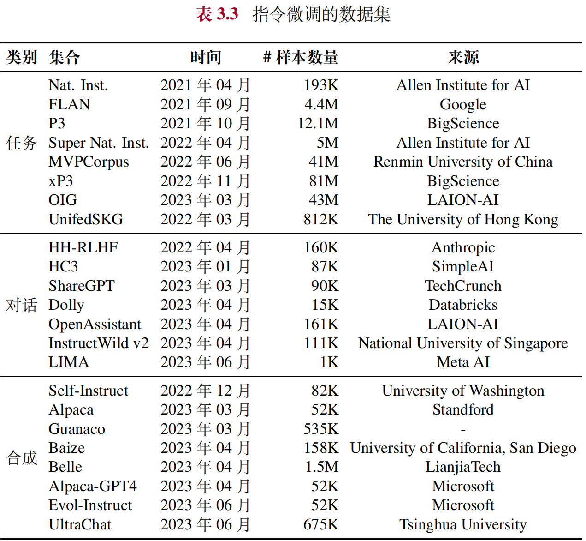
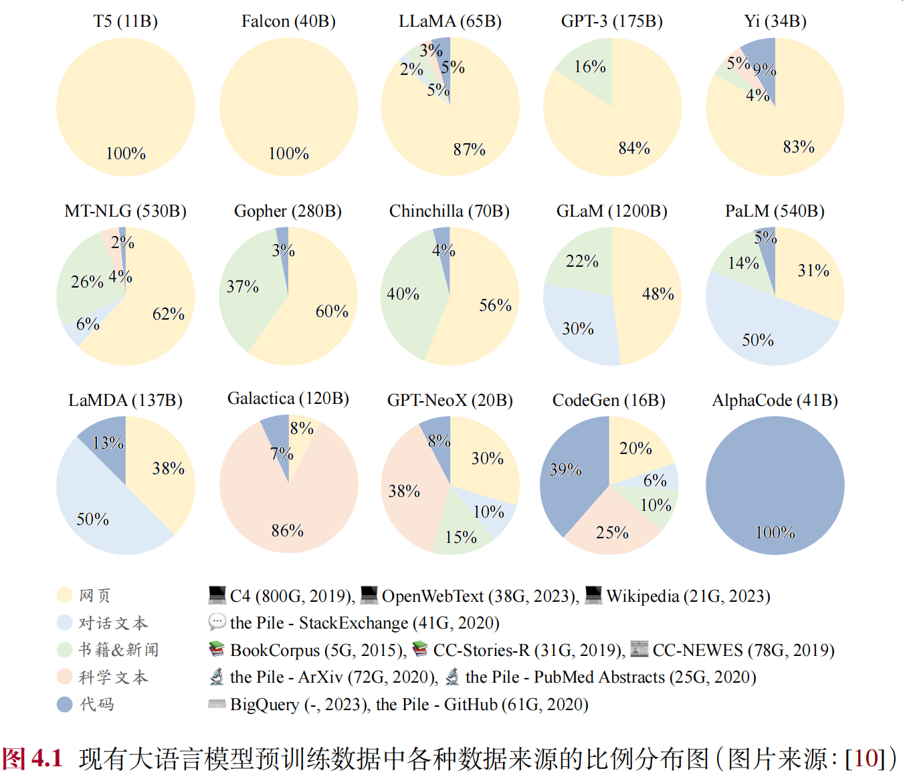

# 大语言模型
代码对应LLMBook页码：数据预处理实践（68），BPE分词（71-73）， 
案例对应LLMBook页码：数据预处理（79）
## 第一部分 背景与基础知识
### 第一章 引言
#### 语言模型的4个发展阶段
统计语言模型：由若干个连续上下文单词预测下一词的出现概论，但会出现维数灾难 
神经语言模型：神经网络来建模文本序列生成，如RNN等，用词嵌入隐式表达语义特征 
预训练语言模型：如ELMo可根据下游任务对网络进行微调Fine-Tuning,实习面向特定任务的模型优化 
大语言模型：通过规模扩展通常会带来下游任务的模型性能提升，这种现象被称为“扩展法则” 

#### 大语言模型技术概览
规模扩展：参数、数据、算力的规模扩展，GPT3有175B参数 
数据工程：对海量文本进行下一词预测的优化，使模型学到丰富语义信息，再用文本补全方式解决各种下游任务，含数据采集、清洗和配比 
高效预训练：参数量大因此需使用大规模分布式训练算法来优化大语言模型神经网络参数，为支持分布式训练需专业框架如DeepSpeed和Megatron-LM，搭建的全栈式优化体系架构能支持大模型预训练数据调度安排。 
能力激发：为提升训练好的模型的任务求解能力，需合适的指令微调以及提示策略进行激发诱导，提示模型在未见任务上的泛化能力，如上下文学习、思维链提示等。 
人类对齐：代表性为3H对齐标准，即有用性、诚实性和无害性，为解决这一问题提出了人类反馈强化学习算法，将人类偏好引入大模型的对齐过程，先训练出能区分模型输出质量好坏的奖励模型，进而用强化学习算法来指导模型输出行为的调整，让语言模型生成符合人类预期的输出。犹豫强化学习算法RLHF优化过程复杂，学术界出现了一批监督微调的对齐方式，从而简化RLHF优化过程，如DPO算法 
工具使用：大语言模型在非自然语言形式的任务能力受限，因此工具学习成为扩展大模型能力的关键技术，让其学会各种工具的调用方法，进而实现特定功能需求，如调用搜索引擎等。 

语言模型的能力特点：具有较为丰富的世界知识，具有较强通用任务解决能力，具有较好的复杂任务推理能力，具有较强人类指令遵循能力，具有较好的人类对齐能力，具有可拓展的工具使用能力。 

大语言模型对科技发展的影响：自然语言处理、信息检索、计算机视觉、人工智能赋能科学研究 
### 第二章 基础介绍
大语言模型是指在海量无标注文本数据上进行预训练得到的大型预训练语言
模型，例如 GPT-3，PaLM和LLaMA。 
#### 大语言模型的构建过程
大语言模型是一种基于Transformer结构的神经网络模型，因此构建其的过程就说使用训练数据对于模型参数的拟合过程，本质是做模型参数的优化，大语言模型的优化目标更加泛化，希望作为通用任务的求解器。 
因此训练过程可分为 大规模预训练 和 指令微调与人类对齐 两个阶段 
1. 大规模预训练 
需准备大规模、高质量、多源化的文本数据，并进行严格的清洗去除掉有毒有害的内容，最后将清洗的数据进行词元化（Tokenization）并切分为批次（Batch） 
目前开源模型普遍采样2-3T规模的词元进行预训练并进一步扩大规模，这一过程算力需求量极高一般训练百亿模型至少需要百卡规模的算力集群（如A100 80G）联合训练数月时间，训练千亿模型则需要千卡甚至万卡规模的算力集群 
而训练中大量需要深入探索的经验性技术如数据如何配比，如何对学习率调整，如何早期发展模型的异常行为等，对核心训练人员能力有巨大考验。 
2. 指令微调（提升任务解决能力）与人类对齐（与人类期望、需求、价值观对齐） 
大规模数据预训练后的语言模型具备了较强的模型能力，但这些模型更擅长文本补全并不适合直接解决具体的任务。 
目前来说较广泛的微调技术是“指令微调”，也叫有监督微调SFT，通过使用任务输入与输出的配对数据进行模型训练，使得模型较好地掌握通过问答形式进行任务求解的能力，这种模仿示例数据进行学习的过程本质属于机器学习中的模仿学习（给定特定任务有多解，模仿学习会加强对于标准答案示范动作的复刻学习）。 
指令微调很难教会大语言模型预训练阶段没学到的知识与能力，主要起了对模型能力的激发作用而不是知识注入 
与与训练相比指令微调数据规模小得多，通常数十万到百万（1-10m量）能有效解决，甚至数千或万条高质量指令数据也能达到不错的微调效果，因此若干台单机八卡（A100-80G）就能在一天或数天时间内完成百亿模型的指令微调。 

与人类对齐中可参照InstructGPT论文，引入基于人类反馈的强化学习对齐方法RLHF，在指令微调后使用强化学习加强模型的对齐能力，在RLHF中需要训练一个符合价值观的奖励模型，为此需要标注人员针对大语言模型所生成的多条输出进行偏好排序并用偏好数据训练奖励模型，用于判断模型输出质量。 
通常强化学习需要维护更多的辅助模型做训练，消耗多于指令微调远小于预训练阶段所需算力，目前一些工作也在消除奖励模型的使用用SFT达到与RLHF相似的效果从而简化过程。  
#### 扩展法则
大模型的成功关键在于对“规模扩展”的充分探索与利用，大语言模型采用了与小型预训练语言模型相似的网络结构（基于Transformer）和预训练方法（如语言建模），通过扩展参数规模、数据规模和计算算力使LLM能力显著提升，下面介绍两种扩展法则： 
1. KM扩展法则 
模型规模N，数据规模D，计算算力C之间的幂律关系
2. Chinchilla扩展法则 
对指导大语言模型充分利用给定算力资源进行优化训练，对更大范围的模型规模（70M到16B）和数据规模（5B到500B）进行实验，拟合找的另一种关于模型性能的幂律关系。 

总结： 
可预测的扩展：扩展法则可用于通过较小算力资源可靠地估计较大算力资源投入后的模型性能：即小模型预估大模型性能或大模型早期训练性能预测训练完成后性能） 
任务层面可预测性：实践中更关注大语言模型真实任务中的性能提示，如语言建模损失的减少是否意味着真实任务上模型性能的提高。有时可能“逆向扩展”即模型损失降低但任务性能变差。 

#### 涌现能力
即小模型中不存在但在大模型中出现的能力。 
代表性的三种涌现能力：上下文学习ICL（GPT-3正式提出），指令遵循（大模型按照自然语言指令执行对应任务，需做指令微调/又名监督微调），逐步推理（解决复杂任务，可应用思维链提示策略） 

#### 扩展法则和涌现能力
提供两种观点来理解大模型对小模型的优势，扩展法则用语言建模损失来衡量整体性能，提升趋势平滑且可预测； 
涌现能力用任务性能来衡量模型性能，可能出现骤升趋势不可预测，但一旦出现则意味着模型性能大幅提升 
可以类比婴儿学习语言的过程，有可衡量标准也有顿悟阶段。 
#### GPT系列模型技术演变
 
GPT 系列模型的基本原理是训练模型学习恢复预训练文本数据，将广泛的世
界知识压缩到仅包含解码器（Decoder-Only）的 Transformer 模型中，从而使模型
能够学习获得较为全面的能力。其中，两个关键要素是：（I）训练能够准确预测下
一个词的 Transformer （只包含解码器）语言模型；（II）扩展语言模型的规模以及
扩展预训练数据的规模。 
 

### 第三章 大语言模型资源
#### 公开可用的模型检查点或API
1. 模型 
LLaMA：13B参数在部分基准测试中超越了175B参数的GPT-3，其在超1T词元的预训练语料上进行了训练，其中65B参数的模型版本在2048张80G的A100GPU上训练了21天，对公众开放且性能优秀，许多研究工作以其为基座模型进行微调或预训练衍生出变体模型 
LLaMA-2：有7B，13B，70B四种参数规模版本且可商用，相比扩充了预训练的词元量达2T，且上下文长度翻倍达到4096个词元，并引入分组查询注意力机制等技术来提升模型性能。此外以此为基座模型完成了“预训练-有监督微调-基于人类反馈的强化学习”这一训练流程，并发布了LLaMA-Chat 
ChatGLM：智谱AI和清华联合开发的中英双语LLM，该系列参数量都是6B，具备流畅对话能力且部署门槛低。 
Falcon：包括7B、40B和180B三个参数版本，7B版本用384张A100使用了1.5T词元进行训练，40B版本的模型在384张A100上使用1T词元训练，180版本模型在4096张A100上使用3.5T词元进行训练，TII也开放了指令微调模型供使用 
Baichuan：百川智能公司发布的开源可商用大语言模型，参数规模7B 
InternLM：上海人工智能实验室开发的多语言开源大模型，已开源7B和20B 
Qwen：阿里的多语大模型系列 
Gemma：谷歌发布的轻量级开源大模型，有2B和7B两种参数规模 
 
2. API 
公共API：GPT系列、以及文本表征的API 
3. 数据集 
常用预训练数据集： 

https://www.gutenberg.org/ebooks/ 
https://dumps.wikimedia.org/ 
https://huggingface.co/datasets/wikipedia 
 
 
4. 代码库 
Hugging Face 
DeepSpeed(微软开发的加速深度学习模型训练的高性能库，与pytorch兼容，广泛用于LLM分布式训练) 
Megatron-LM（NVIDIA开发的专门训练LLM的深度学习代码库，支持数据、模型并行） 
## 第二部分 预训练
### 第四章 数据准备
现有大语言模型预训练数据中各种数据来源： 
 
##### 数据预处理过程
 
0. 预训练数据与实践 
数据数量、质量（重复、有偏、有毒、隐私内容）都会污染数据集，影响模型性能 
实践方法：YuLan-GARDEN是一个集成的预训练数据处理框架，包含了支持探测评估数据的分析模块和包含不同粒度算子的数据处理模块，且支持多进程并行处理大规模预训练数据；用户可通过分析模型初步了解数据整体信息，然后通过改配置文件以自定义框架内预定义好的数据处理算子的参数和顺序，形成定制化的数据处理流程 
代码见LLMBook第68页 
1. 质量过滤 
直接收集的文本数据中掺杂了许多低质量数据，两种清洗方法：基于启发式规则的方法和基于分类器的方法 
**基于启发式规则的方法**:通过精心设计的规则来针对地识别和剔除低质量的文本数据，如处理Reddit数据时通过过滤点赞数少的帖子剔除低质量内容，而处理代码语料时可过滤掉非代码相关格式的数据。 
目前常用：基于语种的过滤（特定目标语言），基于简单统计指标的过滤（如句子长度、标点分布、困惑度评估指标删除表达不自然的句子等），基于关键词过滤（对重复高、有攻击性、电话号码等信息过滤） 
**基于分类器的方法**:可训练用于判别数据质量的文本分类器，进行预训练语料的清洗;如可选取代表性数据做标注（标记高质量数据做正样本，低质量数据做负样本），以此训练出一个精准的文本质量分类器 
目前常用：轻量级模型（如FastText）,可微调预训练语言模型（如BERT，LLaMA等）及闭源大模型API。 
为了平衡效率与准确性，可以针对具体数据集合进行清洗策略的灵活组合。例
如，可以首先利用启发式规则进行初步筛选，以快速排除不符合要求的文档，随
后再采用分类器方法进一步精细过滤，确保最终筛选出的语料具有较好的文本质
量。 
2. 敏感内容过滤 
过滤有毒内容：Jigsaw评论数据集提供用于训练毒性分类器的数据，包括有毒、严重有毒、有威胁、侮辱性、暴力、身份仇恨等六个类别，设置合理阈值可训练出分类器并过滤掉有毒的内容信息。 
过滤隐私内容：互联网上内容可能包括敏感信息或可识别的个人信息，直接方法是用启发式方法如关键字识别来删除私人信息 
3. 数据去重 
大语言模型具有较强数据拟合和记忆能力，容易习得数据中重复模式即过度学习，研究发现语料中重复低质量数据可能诱导模型生成时频繁输出类似数据进而影响性能。 
为避免此数据集污染问题，需要从预训练数据集中删除在测试集中可能出现的重复或相关文本，防止训练集测试集重叠，因此算法可基于不同计算粒度以及匹配方法。 
方法有：计算粒度，用于去重的匹配方法（精确匹配算法或近似匹配算法） 
4. 词元化Tokenization（分词） 
旨在将原始文本分割成模型可识别和建模的词元序列，由于中文可能有海量低频词，因此一些模型用字符作为最小单位来分词，最近**子词分词器**被广泛应用于基于transformer的语言模型中，包括BPE分词、WordPiece分词和Unigram分词。 
代码见LLMBook第71页 
（1）BPE分词&字节级别的BPE 
从一组基本符号开始，迭代地寻找语料库中两个相邻词元并将其替换为新词元（合并） 
（2）WordPiece分词(与BPE类似，迭代合并连续的词元) 
区别是标准略有不同，合并前会首先训练一个语言模型，并用其对所有可能的词元进行评分，每次合并时选择使得训练数据的似然性增加最多的词元对 
（3）Unigram分词 
从足够大的字符串或词元初始集合开始，迭代的删除其中词元至达到语气词表大小 
（0）分词器的选用 
关注几个因素：分词器具备无所重构的特性（无误还原原始文本），高压缩率（分词后词元尽可能少，用压缩率计算衡量） 
5. 数据调度 
完成预处理后需设计合适的调度策略来安排这些多来源的数据，进而用于训练大语言模型，通常数据调度关注两个方面：各个数据源混合比例以及各数据源用于训练的顺序 
 
（1）数据混合 
设置合适的混合比例十分重要，可在不同阶段采用不同混合数据比例，预训练期间根据混合比例从不同数据源中采样数据 
数据混合策略（基于经验）：增加数据源的多样性（网页、书籍、代码）、优化数据混合（除手动设置数据混合配比外还可使用可学习的方法来优化数据组成，如根据下游任务选择特征空间相似的预训练数据或可对下游任务产生正面影响的数据）、优化特定能力（如使用更多数学文本和代码增加模型推理能力） 
（2）数据课程 
指按照特定的顺序安排预训练数据进行模型的训练，例如从简单通用的数据开始，逐渐引入更具挑战性/专业化的数据，即训练的不同阶段使用不同的数据源配比。 
一种实用方法是基于专门构建的评测基准监控大语言模型的关键能力的学习过程，然后在预训练期间动态调整数据的混合配比 
以三种常见能力为例介绍数据课程在继续预训练中的应用： 
代码能力、数学能力、长文本能力 

### 第五章 模型架构
 
#### 5.1 Transformer模型

#### 5.2 详细配置

#### 5.3 主流框架

#### 5.4 上下文模型

#### 5.5 新型架构模型

### 第六章 模型预训练
#### 6.1 预训练任务

#### 6.2 训练优化设置

#### 6.3 高效可扩展技术

#### 6.4 效率分析

#### 6.5 代码实践

## 第三部分 微调与对齐
### 第七章 指令微调

### 第八章 人类对齐

## 第四部分 大模型应用
### 第九章 解码与部属

### 第十章 提示学习

### 第十一章 规划与智能体

## 第五部分 评测与应用
### 第十二章 评测

### 第十三章 应用

