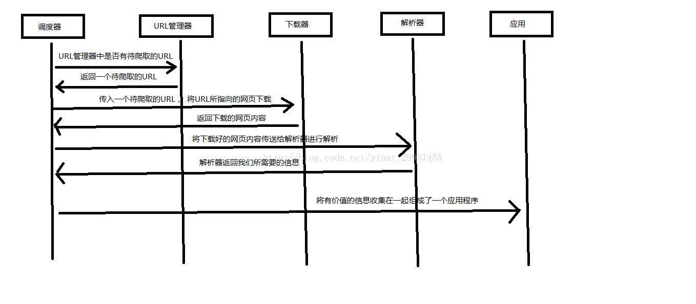

# 网络爬虫
https://blog.csdn.net/Z987421/article/details/133824406


1. 爬取网页
2. 逐一解析数据
3. 保存网页
### 完整示例
```commandline
# -*- codeing = utf-8 -*-
from bs4 import BeautifulSoup  # 网页解析，获取数据
import re  # 正则表达式，进行文字匹配`
import urllib.request, urllib.error  # 制定URL，获取网页数据
import xlwt  # 进行excel操作
#import sqlite3  # 进行SQLite数据库操作

findLink = re.compile(r'<a href="(.*?)">')  # 创建正则表达式对象，标售规则   影片详情链接的规则
findImgSrc = re.compile(r'(.*)</span>')
findRating = re.compile(r'<span class="rating_num" property="v:average">(.*)</span>')
findJudge = re.compile(r'<span>(\d*)人评价</span>')
findInq = re.compile(r'<span class="inq">(.*)</span>')
findBd = re.compile(r'<p class="">(.*?)</p>', re.S)

def main():
    baseurl = "https://movie.douban.com/top250?start="  #要爬取的网页链接
    # 1.爬取网页
    datalist = getData(baseurl)
    savepath = "豆瓣电影Top250.xls"    #当前目录新建XLS，存储进去
    # dbpath = "movie.db"              #当前目录新建数据库，存储进去
    # 3.保存数据
    saveData(datalist,savepath)      #2种存储方式可以只选择一种
    # saveData2DB(datalist,dbpath)

# 爬取网页
def getData(baseurl):
    datalist = []  #用来存储爬取的网页信息
    for i in range(0, 10):  # 调用获取页面信息的函数，10次
        url = baseurl + str(i * 25)
        html = askURL(url)  # 保存获取到的网页源码
        # 2.逐一解析数据
        soup = BeautifulSoup(html, "html.parser")
        for item in soup.find_all('div', class_="item"):  # 查找符合要求的字符串
            data = []  # 保存一部电影所有信息
            item = str(item)
            link = re.findall(findLink, item)[0]  # 通过正则表达式查找
            data.append(link)
            imgSrc = re.findall(findImgSrc, item)[0]
            data.append(imgSrc)
            titles = re.findall(findTitle, item)
            if (len(titles) == 2):
                ctitle = titles[0]
                data.append(ctitle)
                otitle = titles[1].replace("/", "")  #消除转义字符
                data.append(otitle)
            else:
                data.append(titles[0])
                data.append(' ')
            rating = re.findall(findRating, item)[0]
            data.append(rating)
            judgeNum = re.findall(findJudge, item)[0]
            data.append(judgeNum)
            inq = re.findall(findInq, item)
            if len(inq) != 0:
                inq = inq[0].replace("。", "")
                data.append(inq)
            else:
                data.append(" ")
            bd = re.findall(findBd, item)[0]
            bd = re.sub('<br(\s+)?/>(\s+)?', "", bd)
            bd = re.sub('/', "", bd)
            data.append(bd.strip())
            datalist.append(data)

    return datalist

# 得到指定一个URL的网页内容
def askURL(url):
    head = {  # 模拟浏览器头部信息，向豆瓣服务器发送消息
        "User-Agent": "Mozilla / 5.0(Windows NT 10.0; Win64; x64) AppleWebKit / 537.36(KHTML, like Gecko) Chrome / 80.0.3987.122  Safari / 537.36"
    }
    # 用户代理，表示告诉豆瓣服务器，我们是什么类型的机器、浏览器（本质上是告诉浏览器，我们可以接收什么水平的文件内容）

    request = urllib.request.Request(url, headers=head)
    html = ""
    try:
        response = urllib.request.urlopen(request)
        html = response.read().decode("utf-8")
    except urllib.error.URLError as e:
        if hasattr(e, "code"):
            print(e.code)
        if hasattr(e, "reason"):
            print(e.reason)
    return html

# 保存数据到表格
def saveData(datalist,savepath):
    print("save.......")
    book = xlwt.Workbook(encoding="utf-8",style_compression=0) #创建workbook对象
    sheet = book.add_sheet('豆瓣电影Top250', cell_overwrite_ok=True) #创建工作表
    col = ("电影详情链接","图片链接","影片中文名","影片外国名","评分","评价数","概况","相关信息")
    for i in range(0,8):
        sheet.write(0,i,col[i])  #列名
    for i in range(0,250):
        # print("第%d条" %(i+1))       #输出语句，用来测试
        data = datalist[i]
        for j in range(0,8):
            sheet.write(i+1,j,data[j])  #数据
    book.save(savepath) #保存

if __name__ == "__main__":  # 当程序执行时
    # 调用函数
     main()
    # init_db("movietest.db")
     print("爬取完毕！")
```
### 拆分示例
导入库
```commandline
import csv  #用于把爬取的数据存储为csv格式，可以excel直接打开的  
import time  #用于对请求加延时，爬取速度太快容易被反爬  
from time import sleep #同上  
import random  #用于对延时设置随机数，尽量模拟人的行为  
import requests  #用于向网站发送请求  
from lxml import etree    #lxml为第三方网页解析库，强大且速度快  
```
构造请求url，添加头部信息headers即复制前文标记的User-Agent，通过requests.get方法向服务器发送请求，返回html文本。添加headers目的在于告诉服务器，你是真实的人在访问其网站。如果你不添加headers直接访服务器，会在对方服务器显示python在访问，那么，你很可能会被反爬，常见的反爬就是封你ip。
```commandline
url = 'http://yz.yuzhuprice.com:8003/findPriceByName.jspx?page.curPage=1&priceName=%E7%BA%A2%E6%9C%A8%E7%B1%BB'  
headers = {  
    'User-Agent': "Mozilla/5.0 (Macintosh; Intel Mac OS X 10_14_6) AppleWebKit/537.36 (KHTML, like Gecko) Chrome/81.0.4044.129 Safari/537.36",  
}  
response = requests.get(url, headers=headers, timeout=10)  
html = response.text    
print(html)  
```
而我们需要提取的数据，就潜藏在这网页源代码中，我们要用lxml库中的etree方法解析下网页。
```commandline
parse = etree.HTML(html)  #解析网页  
```
解析完之后，就可以开开心心的提取我们所需要的数据了。方法很多，比如xpath、select、beautiful soup，还有最难的re(正则表达式)。随便找了示例如下<br/>
```commandline
findLink = re.compile(r'<a href="(.*?)">')  # 创建正则表达式对象，标售规则   影片详情链接的规则
findImgSrc = re.compile(r'(.*)</span>')
findRating = re.compile(r'<span class="rating_num" property="v:average">(.*)</span>')
findJudge = re.compile(r'<span>(\d*)人评价</span>')
findInq = re.compile(r'<span class="inq">(.*)</span>')
findBd = re.compile(r'<p class="">(.*?)</p>', re.S)
```
数据有了，咱们还得保存csv格式到本地，这一步比较简单，直接贴代码。
```commandline
with open('wood.csv', 'a', encoding='utf_8_sig', newline='') as fp:  
    # 'a'为追加模式（添加）  
    # utf_8_sig格式导出csv不乱码  
    fieldnames = ['name', 'price', 'unit', 'supermaket', 'time']  
    writer = csv.DictWriter(fp, fieldnames)  
    writer.writerow(tr)
```


### 补充：urllib2 实现下载网页的三种方式
```commandline
#!/usr/bin/python
# -*- coding: UTF-8 -*-
 
import cookielib
import urllib2
 
url = "http://www.baidu.com"
response1 = urllib2.urlopen(url)
print "第一种方法"
#获取状态码，200表示成功
print response1.getcode()
#获取网页内容的长度
print len(response1.read())
 
print "第二种方法"
request = urllib2.Request(url)
#模拟Mozilla浏览器进行爬虫
request.add_header("user-agent","Mozilla/5.0")
response2 = urllib2.urlopen(request)
print response2.getcode()
print len(response2.read())
 
print "第三种方法"
cookie = cookielib.CookieJar()
#加入urllib2处理cookie的能力
opener = urllib2.build_opener(urllib2.HTTPCookieProcessor(cookie))
urllib2.install_opener(opener)
response3 = urllib2.urlopen(url)
print response3.getcode()
print len(response3.read())
print cookie
```

