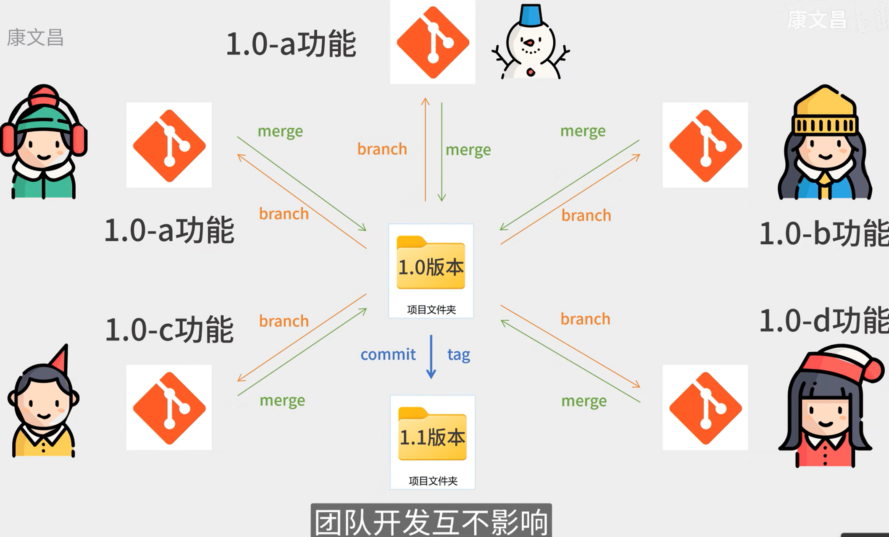
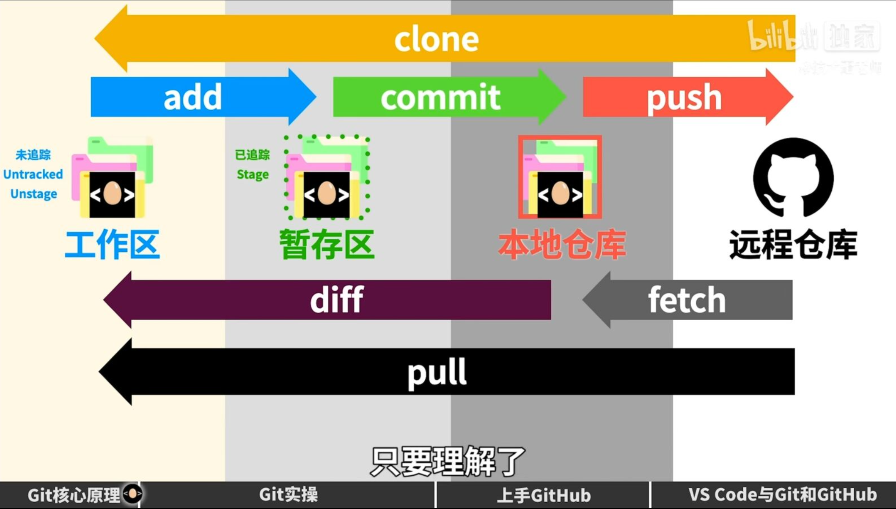

# Git
分布式版本控制系统

https://www.bilibili.com/video/BV1cy4216783/?spm_id_from=333.788&vd_source=c37728f2b9891208b9908ab937dbade2
## 新建git账号、邮箱及指定文件下建立git仓库

git config --global user.name songshijie

git config --global user.email 1724926804

git init  (指定文件夹下创建git仓库)

## 主线与分支管理

**git branch(查看分支)**

git branch fenzhi1(创建分支)

git checkout fenzhi1(切换分支，切换后会读取当前分支内容)

git branch -d fenzhi1(换为-D强制删除分支)

git merge fenzhi2(将其他分支合并到主分支master上)

## 与本地仓库交互
**由工作区上传至本地仓库：**

git add README.md (1显示当前所属分支，添加文件至git中，或git add .)

统一合并各分支后再commit至仓库：

git commit -m "版本时间24.1.5"（2提交缓存区内容！）

git commit -am "版本时间24.1.5"（1+2二合一:将所有修改的已跟踪文件加入到提交中）

**git log (查看前面的更改版本)**

git reset --hard 某次提交的id (本地版本回退到该状态)
## 与远程仓库交互

**由本地仓库上传到远程仓库：**

git remote add origin https://github.com/shijie-zju/zjustudy.git (添加远程仓库)

**git remote -v（查看本地和远程哪些仓库联系）**
git
`git push`（更新至我的远程仓库中）

git push origin main:main -f:或如果不小心创建了分支，可以把它强制规定到主分支下！

**由远程仓库下载到工作区：**

git clone https://github.com/sun-team-zju/songshijie.git （远程克隆到本地）

## 实践练习
1.本地创建仓库 
（1）新建文件夹，并创建test.txt和test2.txt文件，第一行都写1 
（2）文件夹内右键git bash，打开git 
（3）`git init`新建git仓库 
2.提交修改至本地仓库 
（1）再在第二行写2 
（2）`git add .`添加所有内容到缓存区，可分开添加但一般是一次性完成 
（3）`git commit -m add1` 将缓存区添加到本地仓库，命名add1 
（0）`git log`可查看历史各个版本记录
（4）尝试提交至add3后，`git reset --hard bbdb0d9a7a122c5854fd6d8b200e3822413bf0c1`填入log中第二次版本号则退回至第二次版本 
3.远程创建仓库 
（1）GitHub上create repository创一个新的公开远程仓库并记下地址 
（2）`git remote add origin https://github.com/shijie-zju/git_test.git` 本地git中添加远程仓库地址 
（0）`git remote -v`可查看和本地连接的仓库 
4.提交本地仓库至远程仓库 
（1）`git push --set-upstream origin master`实现下面两个功能： 
将你的本地 master 分支推送到远程仓库的 origin 仓库。 
设置远程仓库的 origin/master 为本地 master 分支的上游（/远端）分支。 

5.创建多个新的分支并提交本地（模拟多人本地协作） 
（1）文档修改加4444，然后`git commit -am add4` 
（2）提交至仓库后，`git branch fenzhi4`即将add4操作存入分支4中，先提交后分支！ 
（3）同样创建add5,add6,以及fenzhi5，然后`git checkout master`可在不同分支下切换 
（0）`git branch`查看所有分支；不同分支下`git log`不同，对应不同的操作更改 
6.远程仓库下不同版本的统一与合并（模拟管理员master对不同提交做合并） 
（1）在`master`分支下，`git push`至GitHub上，可发现内容更改
（2）在`fenzhi4`下，`git push`至GitHub上，打开GitHub可发现有提示 
点击compary&pull request,然后如果有冲突`conflicts`不能合并，就点resolve conflicts 
修改后点commit merge提交合并即可允许合并，显示`This branch has no conflicts with the base branch`即点`merge pull request`合并 
红色：有冲突；绿色：可合并；紫色：合并完成。 
7.本地仓库更新内容以同步远程仓库 
（1）`git pull`即可完成将远端内容更新至本地 
（0）如果直接看中了某个GitHub仓库内容，可以直接`git clone https://github.com/sun-team-zju/songshijie.git` （远程克隆到本地）

